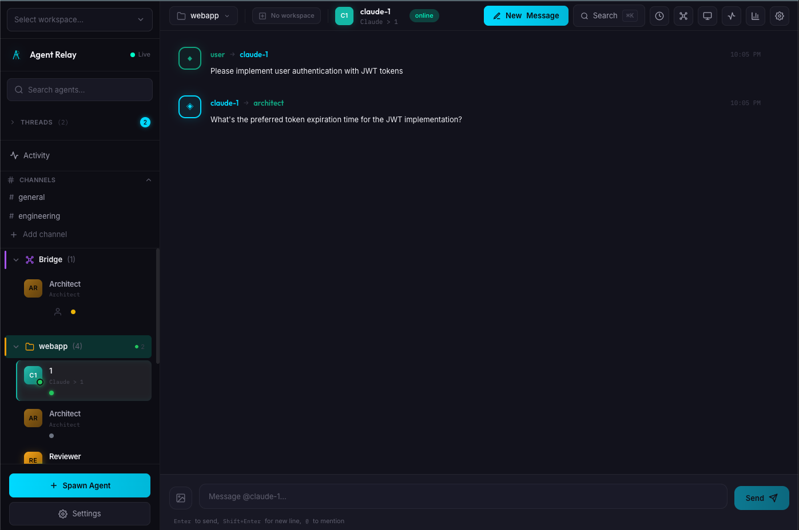

# Agent Relay Dashboard

Web dashboard for [Agent Relay](https://github.com/anthropics/agent-relay) - real-time agent monitoring, communication, and fleet management.

**Works out-of-the-box** - sensible defaults, no configuration required. Can also run standalone with mock data for testing and demos.



## Quick Start

```bash
# Install
npm install

# Run in standalone mode (no dependencies required)
npm run dev:mock

# Or run connected to relay daemon
npm run dev
```

## Architecture

The dashboard supports three operation modes:

### 1. Full Mode (CLI Integration)
Used by `agent-relay up --dashboard`. Direct @agent-relay package integration.
```
┌─────────────────────────────────────────────────┐
│               Dashboard (Full Mode)              │
│  ┌──────────────────────────────────────────┐   │
│  │           Next.js Frontend                │   │
│  │   React Components • Hooks • API Client   │   │
│  └────────────────┬─────────────────────────┘   │
│                   │                              │
│  ┌────────────────▼─────────────────────────┐   │
│  │        Full Server (startDashboard)       │   │
│  │   @agent-relay/storage • sdk • bridge     │   │
│  │   Direct DB access • Agent spawning       │   │
│  └──────────────────────────────────────────┘   │
│              Port 3888                           │
└─────────────────────────────────────────────────┘
```

### 2. Proxy Mode (Standalone)
Forwards requests to a running relay daemon.
```
┌─────────────────────┐     ┌─────────────────────┐
│   Dashboard         │     │   Relay Daemon      │
│  ┌──────────────┐   │     │                     │
│  │  Next.js UI  │   │     │   ┌─────────────┐   │
│  └───────┬──────┘   │     │   │  Agents     │   │
│          │          │     │   │  Storage    │   │
│  ┌───────▼──────┐   │     │   │  Bridge     │   │
│  │ Proxy Server │───┼─────┼─▶ └─────────────┘   │
│  └──────────────┘   │     │                     │
│     Port 3888       │     │     Port 3889       │
└─────────────────────┘     └─────────────────────┘
```

### 3. Mock Mode (Development)
Returns fixture data. No external dependencies required.
```
┌─────────────────────────────────────────────────┐
│               Dashboard (Mock Mode)              │
│  ┌──────────────────────────────────────────┐   │
│  │           Next.js Frontend                │   │
│  │   React Components • Hooks • API Client   │   │
│  └────────────────┬─────────────────────────┘   │
│                   │                              │
│  ┌────────────────▼─────────────────────────┐   │
│  │        Express Server (Mock Mode)         │   │
│  │   Returns fixture data • No deps needed   │   │
│  └──────────────────────────────────────────┘   │
│              Port 3888                           │
└─────────────────────────────────────────────────┘
```

## Installation

```bash
# Install globally
npm install -g @agent-relay/dashboard

# Or use npx
npx @agent-relay/dashboard
```

## Usage

### Standalone Mode (No Dependencies)

Perfect for development, testing, and demos:

```bash
# Using npm scripts
npm run dev:mock          # Development with hot reload
npm run start:mock        # Production build

# Using CLI
relay-dashboard --mock
relay-dashboard -m -v     # Mock mode with verbose logging
```

### Connected to Relay Daemon

```bash
# Start relay daemon first
agent-relay up

# Then start dashboard
relay-dashboard
npm run dev
```

### CLI Options

```
relay-dashboard [options]

Options:
  -p, --port <port>        Port to listen on (default: 3888)
  -r, --relay-url <url>    Relay daemon URL (default: http://localhost:3889)
  -s, --static-dir <path>  Static files directory (default: ./out)
  -m, --mock               Run in mock mode - no relay daemon required
  -v, --verbose            Enable verbose logging
  -h, --help               Show help

Examples:
  relay-dashboard                  # Proxy mode
  relay-dashboard --mock           # Standalone with mock data
  relay-dashboard -m -v            # Mock mode, verbose
  relay-dashboard -p 4000 -m       # Custom port
```

### Environment Variables

All environment variables are **optional** - sensible defaults work out-of-the-box.

| Variable | Default | Description |
|----------|---------|-------------|
| `PORT` | 3888 | Dashboard server port |
| `RELAY_URL` | http://localhost:3889 | Relay daemon URL |
| `STATIC_DIR` | ./out | Static files directory |
| `MOCK` | false | Enable mock mode |
| `VERBOSE` | false | Enable verbose logging |
| `CORS_ORIGINS` | (none) | Allowed CORS origins (comma-separated, or `*`) |
| `REQUEST_TIMEOUT` | 30000 | Request timeout in milliseconds |

## Development

```bash
# Install dependencies
npm install

# Development (proxy mode - needs relay daemon)
npm run dev

# Development (mock mode - standalone)
npm run dev:mock

# Build
npm run build

# Run tests
npm test

# Type checking
npm run typecheck

# Test coverage
npm run test:coverage
```

## Project Structure

This is a monorepo with two packages:

```
relay-dashboard/
├── packages/
│   ├── dashboard/              # @agent-relay/dashboard
│   │   ├── src/
│   │   │   ├── app/           # Next.js App Router pages
│   │   │   ├── components/    # React components
│   │   │   │   └── hooks/     # Custom React hooks
│   │   │   ├── lib/           # API clients & utilities
│   │   │   └── types/         # TypeScript definitions
│   │   ├── public/            # Static assets
│   │   ├── out/               # Built static site
│   │   └── index.ts           # Re-exports from dashboard-server
│   │
│   └── dashboard-server/       # @agent-relay/dashboard-server
│       └── src/
│           ├── full-server.ts # Full server with @agent-relay integrations (5,900+ lines)
│           ├── server.ts      # Proxy/mock server for development
│           ├── index.ts       # Package exports
│           ├── start.ts       # CLI entry point
│           ├── services/      # Business logic modules
│           │   ├── metrics.ts
│           │   ├── needs-attention.ts
│           │   ├── user-bridge.ts
│           │   └── health-worker-manager.ts
│           ├── types/         # TypeScript type definitions
│           └── mocks/         # Mock data for standalone mode
│               ├── fixtures.ts
│               └── routes.ts
│
├── package.json               # Root workspace config
└── README.md
```

## Testing

The dashboard includes comprehensive tests:

```bash
# Run all tests
npm test

# Watch mode
npm run test:watch

# Coverage report
npm run test:coverage
```

### Test Categories

- **Server Tests** - Mock mode, proxy mode, health checks
- **Fixture Tests** - Validates mock data structure
- **Component Tests** - React component tests

## Mock Data

Mock mode includes realistic fixture data for:

- **Agents** - Multiple agents with different statuses
- **Messages** - Sample message threads
- **Sessions** - Active and historical sessions
- **Channels** - Team communication channels
- **Decisions** - Pending approval/choice decisions
- **Tasks** - Task assignments with various states
- **Fleet** - Multi-server fleet statistics
- **Metrics** - System and agent metrics

All fixtures are in `packages/dashboard-server/mocks/fixtures.ts` and can be customized.

## API Endpoints

### In Mock Mode
Returns fixture data for all endpoints:

| Endpoint | Description |
|----------|-------------|
| `GET /api/data` | Dashboard data (agents, messages, sessions) |
| `GET /api/agents/:name/online` | Agent online status |
| `POST /api/spawn` | Spawn agent (mock) |
| `POST /api/send` | Send message (mock) |
| `GET /api/channels` | List channels |
| `GET /api/decisions` | List pending decisions |
| `GET /api/tasks` | List tasks |
| `GET /api/metrics` | System metrics |
| `GET /api/fleet/stats` | Fleet statistics |
| `WS /ws` | WebSocket (sends periodic mock updates) |

### In Proxy Mode
Forwards to relay daemon at configured URL.

## Deployment

### Fly.io

```bash
fly apps create relay-dashboard
fly secrets set RELAY_URL=https://your-relay.fly.dev
fly deploy
```

### Docker

```bash
docker build -t relay-dashboard .

# Mock mode
docker run -p 3888:3888 -e MOCK=true relay-dashboard

# Proxy mode
docker run -p 3888:3888 -e RELAY_URL=http://relay:3889 relay-dashboard
```

### Static Hosting

Export to `out/` and deploy to any static host. Configure reverse proxy for `/api/*` and `/ws`.

## Features

- **Real-time monitoring** - Live agent status, messages, and activity via WebSocket
- **Fleet management** - Multi-project/workspace support with Bridge view
- **Communication** - Channels, direct messages, broadcasts, @mentions
- **Terminal logs** - Stream live PTY output from agents
- **Decision queue** - Approve/reject agent decisions requiring human input
- **Metrics** - System health, throughput, session lifecycle
- **Theming** - Light/dark mode, compact display options

## License

Apache-2.0 - Copyright 2025 Agent Workforce Incorporated
